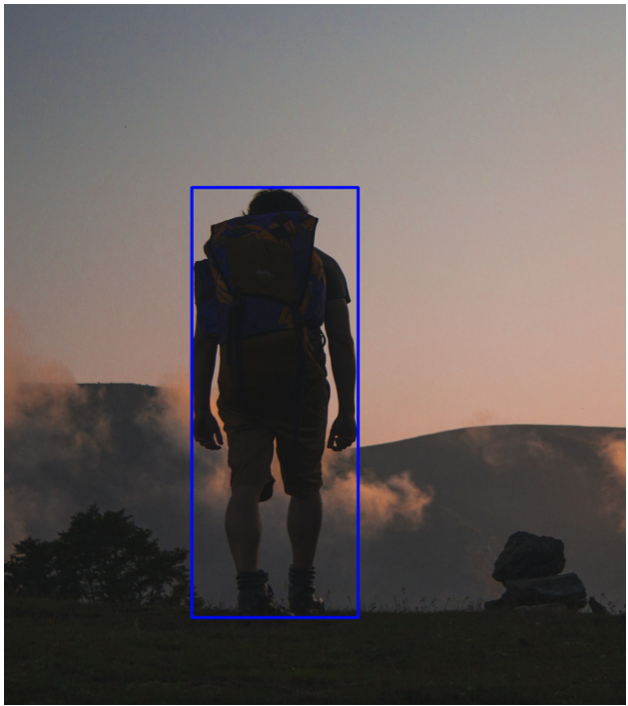
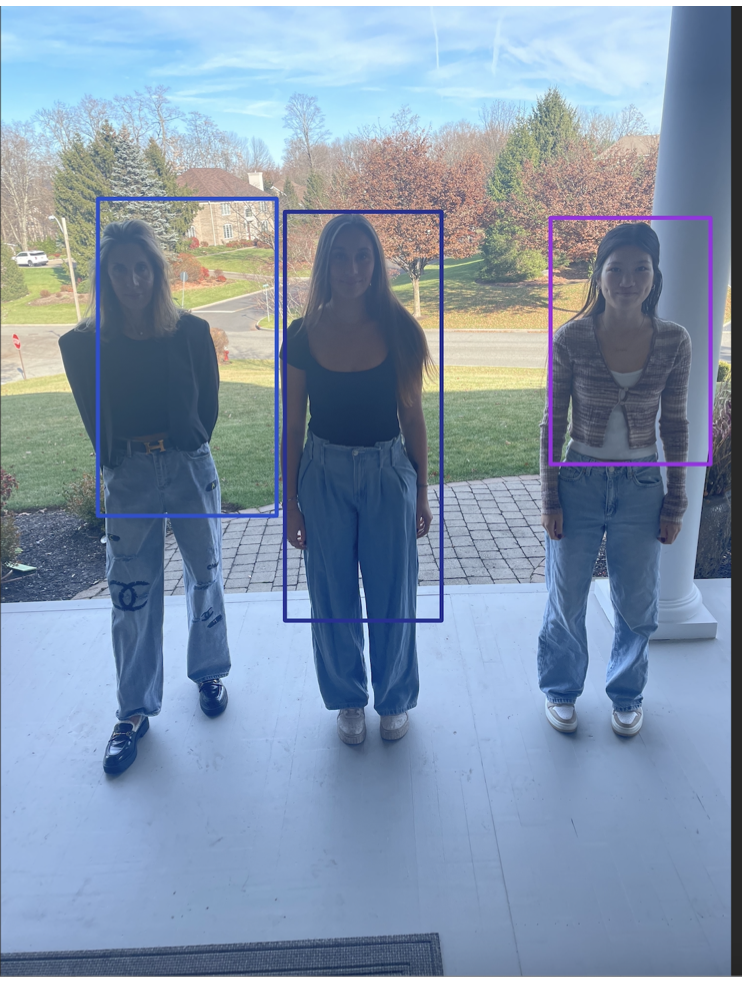

Troy Daniels - Multi-object detection

This README assumes knowledge of the tast at hand (CNN, ML, Bounding Box Regression, IoU metric...) for a more complete understanding/explaination please see the PDF in repository.


# Overview

This project is a implementation of Multi-object (person) detection in images using Tensorflow and Keras in Python. (Tensorflow version - 2.13.) The dataset used is a collection of 847 images containing a person, downloaded from Kaggle.[3] The images are all different sizes and have a wide variety of backgrounds. Furthermore, a csv file is attached to the dataset containing the ground truth bounding box for each image, four integers representing the original image’s pixel coordinates.

## Training Proccess
1. Data is loaded, preproccessed and then split into training, test and validation sets. Preproccess insists of normalizing each image's size and pixel values and then matching each image to a normalized label (bounding box)

```python
for image in images:
        H, W, C = image.shape
        image = cv.resize(image, (256,256))
        image = (image - 127.5)/127.5
        images.append(image)
        norm_x1 = x1 / W
        norm_y1 = y1 / H
        norm_x2 = x2 / W
        norm_y2 = y2 / H
        bbox = [norm_x1,norm_y1,norm_x2,norm_y2]
        bboxes.append(bbox)
training_data = np.array(images[:round(len(images)*0.8)])
training_labels = np.array(bboxes[:round(len(images)*0.8)])
testing_data = np.array(images[round(len(images)*0.8):round(len(images)*0.9)])
testing_labels = np.array(bboxes[round(len(images)*0.8):round(len(images)*0.9)])
validation_data = np.array(images[round(len(images)*0.9):])
validation_labels = np.array(bboxes[round(len(images)*0.9):])
```




2. Create the CNN architecture for bounding box regression, one used for best results was MobileNet. Train the model against the training set. Predictions from test set are shown below. (blue = ground truth, green = prediction)


3. Create CNN architecture for objectiveness score regression, one used for best results was MobileNet. Train the model against the training set.

```python
if __name__ == "__main__":
    input_shape = (256,256,3)
    model = build_model(input_shape)
    model.compile(optimizer=tf.keras.optimizers.Adam(learning_rate=1e-3), loss=tf.keras.losses.MeanSquaredError())
    model.summary()
    # tf.keras.utils.plot_model(model,to_file="moble_net_model.png")
    (training_data, training_labels), (testing_data, testing_labels), (validation_data, validation_labels) = ModelFunctions.splitImagesWithBoundingBox()
    
    checkpoint_cb = tf.keras.callbacks.ModelCheckpoint("MobileNet_myobjectiveness_score_model.hs", save_best_only = True)
    history = model.fit(training_data, training_labels, epochs=500, validation_data= (validation_data, validation_labels),callbacks = [checkpoint_cb])
    pd.DataFrame(history.history).plot(ylim=(0, 0.1))
    plt.show()
    plt.savefig("loss_myobjectiveness_graph_MobileNet_.png")
```

## Multi-Object Detection

1. Segment the given image in many different sizes. Preproccess (normalize) each segment (same proccess done in training)

Each call to slidefilter in the code below slides a filter accross the image (each time becoming a new segment of the image), the float passed into the function parameters represents the hight and width of the filter.
```python
images = []
segmentCoordinates = []
slidefilter(image, images, 1.2,segmentCoordinates)
slidefilter(image, images, 1.5,segmentCoordinates)
slidefilter(image, images, 1.5,segmentCoordinates) 
slidefilter(image, images, 2,segmentCoordinates)
slidefilter(image, images, 3,segmentCoordinates)
slidefilter(image, images, 5, segmentCoordinates)
return images, segmentCoordinates
```

2. Pass each segment to the bounding box regression model. Pass each segment and bounding box regression prediction to objectiveness score regression model. Use Both IoU metric and objectivness score predictions to filter out bounding box regression predictions until only disired amount remains. Each one remaining represents an object with their relative location within the image. See some results below:





